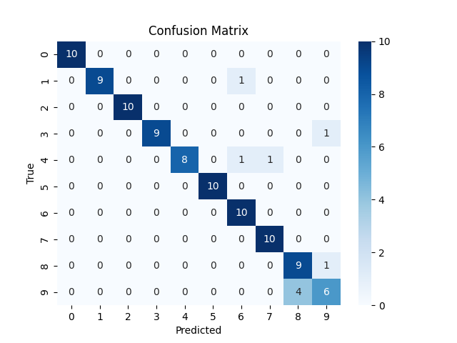

# Image Classification with Euclidean Distance

This project implements an image classification model using Euclidean distance to classify images based on their extracted features. The model uses **HOG (Histogram of Oriented Gradients)** features for image representation and applies **PCA (Principal Component Analysis)** for dimensionality reduction before using Euclidean distance to classify the images.

## Project Overview

The goal of this project is to build an image classification model that can classify images into various categories based on their features. The model uses the Euclidean distance metric to determine the most similar image from the training set for each test image.

## Features

- **HOG Feature Extraction**: Extracts Histogram of Oriented Gradients (HOG) features from images for object recognition.
- **PCA for Dimensionality Reduction**: Reduces the number of features in the dataset, improving efficiency while maintaining the discriminative power of the features.
- **Euclidean Distance Classification**: Classifies test images by calculating the Euclidean distance between the test image's features and the features of each training image, selecting the closest match.
- **Confusion Matrix Visualization**: Displays the confusion matrix to show the performance of the classifier.
- **Misclassified Image Display**: Displays misclassified images along with their true labels and predicted labels for inspection.

## Requirements

- Python 3.x
- OpenCV
- NumPy
- scikit-learn
- matplotlib
- seaborn
- scikit-image

### Install the required libraries

You can install the required libraries by running the following command:

```bash
pip install opencv-python numpy scikit-learn matplotlib seaborn scikit-image
```
### Dataset

The dataset should be organized in the following structure:

```bash
dataset/
  train/
    <class_1>/
      <image_1.jpg>
      <image_2.jpg>
      ...
    <class_2>/
      <image_1.jpg>
      <image_2.jpg>
      ...
    ...
  test/
    <class_1>/
      <image_1.jpg>
      <image_2.jpg>
      ...
    <class_2>/
      <image_1.jpg>
      <image_2.jpg>
      ...
    ...
```

Where each class folder contains images of that class, and both the training and testing folders are organized similarly.
How to Run

- Clone the repository to your local machine.

- Organize your dataset according to the directory structure mentioned above.

- Run the script to train and test the classifier.

python image_classification.py

The script will:

- Load and preprocess the images (resize, convert to grayscale, extract HOG features).

- Apply PCA to reduce the dimensionality of the feature vectors.

- Train the model using the Euclidean distance metric.

- Evaluate the model by generating the classification report and confusion matrix.

- Display any misclassified images along with their true and predicted labels.

### Results

- Classification Report: Provides precision, recall, f1-score, and accuracy for each class.

- Confusion Matrix: Visualizes the classification performance using a heatmap.

- Misclassified Images: Shows images that were misclassified by the model for further analysis.

#### Example Output
```bash
Classification Report:

              precision    recall  f1-score   support

           0       0.95      0.93      0.94        30
           1       0.92      0.96      0.94        30
           2       0.89      0.87      0.88        30
           3       0.93      0.90      0.91        30

    accuracy                           0.93       120
   macro avg       0.92      0.92      0.92       120
weighted avg       0.92      0.93      0.92       120

```
## Confusion Matrix:

### kNN


### euclidean_distance

Misclassified Images:

Each misclassified image is shown with the true and predicted labels.
Future Improvements

    Model Tuning: Experiment with different feature extraction methods and dimensionality reduction techniques.

    Advanced Classification Models: Implement more advanced models such as SVM, decision trees, or deep learning-based methods.

    Data Augmentation: Increase the dataset size by applying transformations like rotations, flips, and scaling to improve model generalization.

License

This project is licensed under the MIT License - see the LICENSE file for details.
Acknowledgements

    OpenCV for image processing.

    scikit-learn for machine learning utilities.

    scikit-image for feature extraction.

    Matplotlib and Seaborn for visualization.


### Key Points:
- **Euclidean Distance**: This method is the key algorithm used for classification, instead of KNN.
- **PCA & HOG**: Principal Component Analysis (PCA) reduces the feature size, and HOG helps capture important gradient-based features from images.
- **Evaluation**: The `classification_report`, `accuracy_score`, and confusion matrix help evaluate the performance of the model.

You can adjust the content of the `README.md` based on your project specifics, such as the type of images you're working with or if there are specific improvements you want to add.